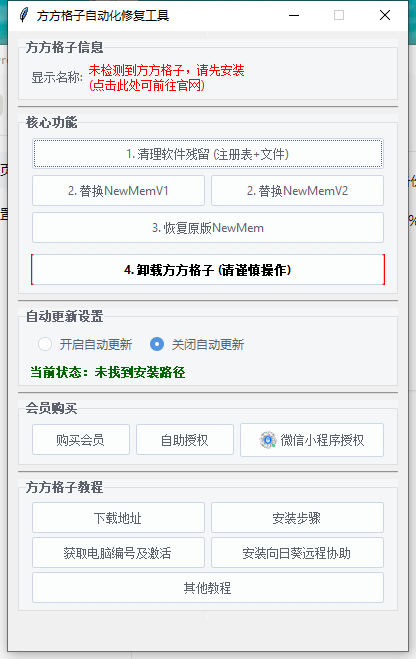

# 方方格子残留信息清除工具 {docsify-ignore-all}

- 部分方方格子会检测永久期限的会员授权，导致需要频繁重复激活，本脚本用来清除相关的注册表信息    

## 解决办法：    
1、卸载掉现在方方格子    
2、使用下面的`方方格子修复工具`清除相关的残留文件。    
3、重新安装方方格子。

    
[方方格子修复工具](https://github.com/11195666/ffcell_doc/blob/main/src/%E6%96%B9%E6%96%B9%E6%A0%BC%E5%AD%90%E4%BF%AE%E5%A4%8D%E5%B7%A5%E5%85%B7.exe)

