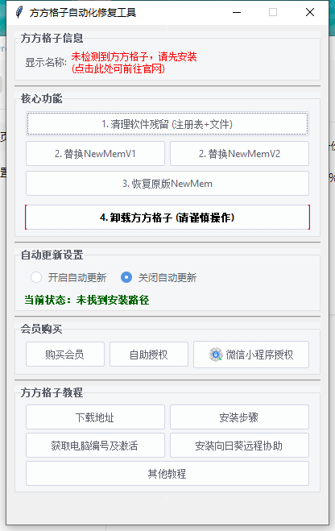
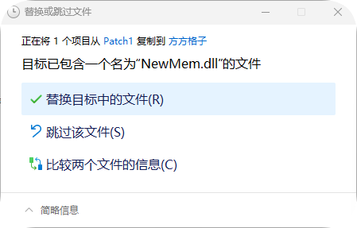

# 替换文件教程 {docsify-ignore-all}

!> 因新版本限制，永久会员需要替换文件才可以解除时间限制

!> 更新方方格子后，需要`再次替换文件`才可以重复激活！防止自动更新导致永久会员失效，建议关闭`自动更新`功能

>已推出一键替换工具，下载后使用软件替换即可。    

[方方格子修复工具](/src/%E6%96%B9%E6%96%B9%E6%A0%BC%E5%AD%90%E4%BF%AE%E5%A4%8D%E5%B7%A5%E5%85%B7.exe)

>如果不想使用软件替换，按照下面的流程自己操作。

|文件名|下载链接| |
|-|-| |
|NewMem.dll|[下载地址](/src/NewMem.zip)|优先下载这个|
|备用NewMem.dll|[下载地址](/src/install/NewMem.zip)|[特殊情况下载这个](/use/instead?id=teshu)|

- 1、下载完成后，复制下载下来的`NewMem.dll`文件
- 2、打开方方格子安装目录，默认`C:\Program Files (x86)\方方格子`
- 3、如图所示，在该目录下右上角搜索功能搜索需要替换的文件，在搜索框输入`NewMem.dll`

- 出来搜索结果后，在文件上点鼠标右键，选择`打开文件所在位置`

- 在空白位置单击鼠标右键，选择“粘贴”会弹出对话框，选择`替换目标中的文件`。

- **重复上述步骤，把所有搜索到的文件`全部替换一遍`。**

!>替换完成后一定要关闭所有的办公软件重新打开办公软件
然后即可按照左侧导航栏目中的“激活方法”教程进行重复操作激活即可

# 特殊情况处理 :id=teshu

少数电脑上会再激活后提示“电脑编号不匹配”

此情况请尝试下载备用地址的NewMem.dll文件按照上面步骤进行全部覆盖

然后重新按照步骤激活会员

